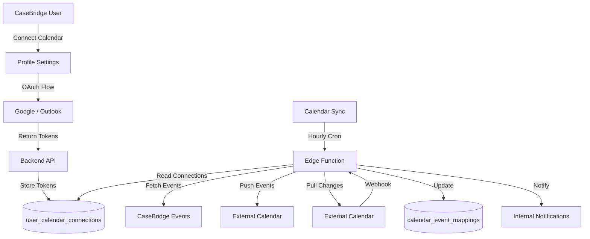

# CaseBridge Calendar Integration Enhancement - Implementation Plan

## Executive Summary

This document outlines the implementation plan for enhancing the Calendar Integration feature in CaseBridge. The goal is to enable two-way synchronization between CaseBridge's internal calendar and external calendar providers (Google Calendar and Microsoft Outlook).

---

## Current State Analysis

### What's Already Implemented ✅

| Component                         | Location                                                                                                       | Status      |
| --------------------------------- | -------------------------------------------------------------------------------------------------------------- | ----------- |
| `user_calendar_connections` table | [`20260203_CALENDAR_SYNC_OAUTH.sql`](CaseBridge_Internal/supabase/migrations/20260203_CALENDAR_SYNC_OAUTH.sql) | ✅ Complete |
| Calendar sync token in profiles   | [`CALENDAR_SYNC_INIT.sql:31`](CaseBridge_Internal/supabase/CALENDAR_SYNC_INIT.sql:31)                          | ✅ Complete |
| iCal export view                  | [`CALENDAR_SYNC_INIT.sql:35`](CaseBridge_Internal/supabase/CALENDAR_SYNC_INIT.sql:35)                          | ✅ Complete |
| Task calendar export view         | [`CALENDAR_SYNC_INIT.sql:57`](CaseBridge_Internal/supabase/CALENDAR_SYNC_INIT.sql:57)                          | ✅ Complete |
| Calendar connection UI            | [`ProfileSettings.tsx:67`](CaseBridge_Internal/src/pages/internal/ProfileSettings.tsx:67)                      | ✅ Partial  |
| Calendar sync modal               | [`InternalCalendar.tsx:520`](CaseBridge_Internal/src/pages/internal/InternalCalendar.tsx:520)                  | ✅ Partial  |
| Backend calendar routes           | [`calendarRoutes.js`](backend/src/routes/calendarRoutes.js)                                                    | ✅ Partial  |
| Backend calendar controller       | [`calendarController.js`](backend/src/controllers/calendarController.js)                                       | ✅ Partial  |

### What's Missing ❌

- **OAuth Token Storage**: Access/refresh tokens not being stored properly after OAuth flow
- **Two-way Sync**: No mechanism to push events to external calendars
- **Webhook Handlers**: No handling for external calendar changes
- **Token Refresh**: No automatic token refresh mechanism
- **Calendar Selection**: Users cannot choose which calendar to sync with
- **Sync Status UI**: No visual feedback about sync status

---

## Implementation Plan

### Phase 1: Database Schema Enhancements

#### 1.1 Add Calendar ID Mapping

```sql
-- File: supabase/migrations/CALENDAR_ENHANCEMENT_001.sql

-- Add calendar ID columns to track external calendar IDs
ALTER TABLE public.user_calendar_connections
ADD COLUMN IF NOT EXISTS calendar_id TEXT,
ADD COLUMN IF NOT EXISTS calendar_name TEXT,
ADD COLUMN IF NOT EXISTS sync_direction TEXT DEFAULT 'outbound' CHECK (sync_direction IN ('outbound', 'inbound', 'both')),
ADD COLUMN IF NOT EXISTS webhook_subscription_id TEXT,
ADD COLUMN IF NOT EXISTS webhook_secret TEXT;
```

#### 1.2 Add External Event Mapping Table

```sql
-- Track mapped events between CaseBridge and external calendars
CREATE TABLE IF NOT EXISTS public.calendar_event_mappings (
    id UUID DEFAULT gen_random_uuid() PRIMARY KEY,
    casebridge_event_id UUID NOT NULL REFERENCES public.calendar_events(id) ON DELETE CASCADE,
    external_event_id TEXT NOT NULL,
    provider TEXT NOT NULL CHECK (provider IN ('google', 'outlook')),
    user_id UUID REFERENCES public.profiles(id) ON DELETE CASCADE,
    last_synced_at TIMESTAMPTZ DEFAULT NOW(),
    sync_status TEXT DEFAULT 'synced' CHECK (sync_status IN ('synced', 'pending', 'conflict')),
    created_at TIMESTAMPTZ DEFAULT NOW(),
    UNIQUE(casebridge_event_id, provider, user_id)
);

-- Enable RLS
ALTER TABLE public.calendar_event_mappings ENABLE ROW LEVEL SECURITY;

-- RLS Policy
CREATE POLICY "Users manage own event mappings"
ON public.calendar_event_mappings
FOR ALL
USING (auth.uid() = user_id);
```

---

### Phase 2: Backend API Endpoints

#### 2.1 OAuth Flow Endpoints

| Endpoint                               | Method | Description                     |
| -------------------------------------- | ------ | ------------------------------- |
| `/api/calendar/oauth/google`           | GET    | Initiate Google OAuth           |
| `/api/calendar/oauth/google/callback`  | GET    | Handle Google OAuth callback    |
| `/api/calendar/oauth/outlook`          | GET    | Initiate Microsoft OAuth        |
| `/api/calendar/oauth/outlook/callback` | GET    | Handle Microsoft OAuth callback |
| `/api/calendar/connect`                | POST   | Save OAuth tokens to database   |
| `/api/calendar/disconnect`             | POST   | Remove calendar connection      |

#### 2.2 Sync Endpoints

| Endpoint                        | Method | Description                     |
| ------------------------------- | ------ | ------------------------------- |
| `/api/calendar/sync`            | POST   | Trigger manual sync             |
| `/api/calendar/sync/status`     | GET    | Get sync status                 |
| `/api/calendar/events/external` | GET    | Fetch external calendar events  |
| `/api/calendar/events/push`     | POST   | Push event to external calendar |

#### 2.3 Required NPM Packages

```bash
cd backend && npm install googleapis microsoft-graph-client
```

#### 2.4 Environment Variables Required

```env
# Google OAuth
GOOGLE_CLIENT_ID=your-google-client-id
GOOGLE_CLIENT_SECRET=your-google-client-secret
GOOGLE_REDIRECT_URI=https://your-domain.com/api/calendar/oauth/google/callback

# Microsoft OAuth
MICROSOFT_CLIENT_ID=your-microsoft-client-id
MICROSOFT_CLIENT_SECRET=your-microsoft-client-secret
MICROSOFT_REDIRECT_URI=https://your-domain.com/api/calendar/oauth/outlook/callback
MICROSOFT_TENANT_ID=common
```

#### 2.5 Implementation: Google Calendar Service

```javascript
// backend/src/services/googleCalendar.js

const { google } = require("googleapis");

class GoogleCalendarService {
  constructor(credentials) {
    this.credentials = credentials;
    this.oauth2Client = new google.auth.OAuth2(
      process.env.GOOGLE_CLIENT_ID,
      process.env.GOOGLE_CLIENT_SECRET,
      process.env.GOOGLE_REDIRECT_URI,
    );

    this.oauth2Client.setCredentials({
      access_token: credentials.access_token,
      refresh_token: credentials.refresh_token,
      expiry_date: credentials.expires_at?.getTime(),
    });

    this.calendar = google.calendar({ version: "v3", auth: this.oauth2Client });
  }

  async getCalendarList() {
    const response = await this.calendar.calendarList.list();
    return response.data.items;
  }

  async createEvent(event) {
    const response = await this.calendar.events.insert({
      calendarId: "primary",
      resource: {
        summary: event.title,
        description: event.description,
        start: { dateTime: event.start_time },
        end: { dateTime: event.end_time },
        location: event.location,
        attendees: event.attendees?.map((email) => ({ email })),
      },
    });
    return response.data;
  }

  async updateEvent(eventId, event) {
    const response = await this.calendar.events.patch({
      calendarId: "primary",
      eventId,
      resource: {
        summary: event.title,
        description: event.description,
        start: { dateTime: event.start_time },
        end: { dateTime: event.end_time },
      },
    });
    return response.data;
  }

  async deleteEvent(eventId) {
    await this.calendar.events.delete({
      calendarId: "primary",
      eventId,
    });
  }

  async getEvents(timeMin, timeMax) {
    const response = await this.calendar.events.list({
      calendarId: "primary",
      timeMin,
      timeMax,
      singleEvents: true,
      orderBy: "startTime",
    });
    return response.data.items;
  }
}

module.exports = { GoogleCalendarService };
```

#### 2.6 Implementation: Outlook Calendar Service

```javascript
// backend/src/services/outlookCalendar.js

const { Client } = require("@microsoft/microsoft-graph-client");

class OutlookCalendarService {
  constructor(credentials) {
    this.credentials = credentials;
    this.client = Client.init({
      authProvider: (done) => {
        done(null, credentials.access_token);
      },
    });
  }

  async getCalendars() {
    return await this.client.api("/me/calendars").get();
  }

  async createEvent(event) {
    return await this.client.api("/me/events").post({
      subject: event.title,
      body: {
        contentType: "HTML",
        content: event.description,
      },
      start: {
        dateTime: event.start_time,
        timeZone: "UTC",
      },
      end: {
        dateTime: event.end_time,
        timeZone: "UTC",
      },
      location: event.location ? { displayName: event.location } : undefined,
      attendees: event.attendees?.map((email) => ({
        emailAddress: { address: email },
        type: "required",
      })),
    });
  }

  async updateEvent(eventId, event) {
    return await this.client.api(`/me/events/${eventId}`).patch({
      subject: event.title,
      body: { contentType: "HTML", content: event.description },
      start: { dateTime: event.start_time, timeZone: "UTC" },
      end: { dateTime: event.end_time, timeZone: "UTC" },
    });
  }

  async deleteEvent(eventId) {
    await this.client.api(`/me/events/${eventId}`).delete();
  }

  async getEvents(timeMin, timeMax) {
    return await this.client
      .api("/me/events")
      .filter(`start/dateTime ge '${timeMin}' and end/dateTime le '${timeMax}'`)
      .select("id,subject,body,start,end,location,attendees")
      .get();
  }
}

module.exports = { OutlookCalendarService };
```

---

### Phase 3: Supabase Edge Functions

#### 3.1 Calendar Sync Edge Function

```typescript
// CaseBridge_Internal/supabase/functions/calendar-sync/index.ts

import { serve } from "https://deno.land/std@0.168.0/http/server.ts";
import { createClient } from "https://esm.sh/@supabase/supabase-js@2";

const corsHeaders = {
  "Access-Control-Allow-Origin": "*",
  "Access-Control-Allow-Headers":
    "authorization, x-client-info, apikey, content-type",
};

serve(async (req) => {
  if (req.method === "OPTIONS") {
    return new Response("ok", { headers: corsHeaders });
  }

  try {
    const supabase = createClient(
      Deno.env.get("SUPABASE_URL")!,
      Deno.env.get("SUPABASE_SERVICE_ROLE_KEY")!,
    );

    // Get all active calendar connections
    const { data: connections } = await supabase
      .from("user_calendar_connections")
      .select("*, profiles(*)")
      .eq("sync_enabled", true);

    const results = [];

    for (const conn of connections || []) {
      try {
        // Refresh token if needed
        let credentials = {
          access_token: conn.access_token,
          refresh_token: conn.refresh_token,
          expires_at: new Date(conn.expires_at),
        };

        if (new Date(conn.expires_at) < new Date()) {
          // Token expired - refresh it
          credentials = await refreshToken(conn.provider, conn.refresh_token);

          await supabase
            .from("user_calendar_connections")
            .update({
              access_token: credentials.access_token,
              refresh_token: credentials.refresh_token,
              expires_at: credentials.expires_at,
            })
            .eq("id", conn.id);
        }

        // Sync events based on provider
        if (conn.provider === "google") {
          // Implement Google sync logic
        } else if (conn.provider === "outlook") {
          // Implement Outlook sync logic
        }

        results.push({ user_id: conn.user_id, status: "success" });
      } catch (error) {
        results.push({
          user_id: conn.user_id,
          status: "error",
          error: error.message,
        });
      }
    }

    return new Response(JSON.stringify({ results }), {
      headers: { ...corsHeaders, "Content-Type": "application/json" },
    });
  } catch (error) {
    return new Response(JSON.stringify({ error: error.message }), {
      status: 500,
      headers: { ...corsHeaders, "Content-Type": "application/json" },
    });
  }
});
```

---

### Phase 4: Frontend Components

#### 4.1 Enhanced Calendar Connection UI

**File**: [`CaseBridge_Internal/src/pages/internal/ProfileSettings.tsx`](CaseBridge_Internal/src/pages/internal/ProfileSettings.tsx)

**Changes Needed**:

- Add proper OAuth redirect handling
- Add connection status indicators
- Add disconnect functionality
- Add calendar selection dropdown

#### 4.2 Sync Status Dashboard

**New Component**: `CaseBridge_Internal/src/components/calendar/SyncStatusPanel.tsx`

```tsx
interface SyncStatus {
  provider: "google" | "outlook";
  lastSync: Date;
  eventsCount: number;
  status: "synced" | "syncing" | "error";
  errorMessage?: string;
}

export default function SyncStatusPanel({
  connections,
}: {
  connections: SyncStatus[];
}) {
  return (
    <div className="space-y-4">
      {connections.map((conn) => (
        <div key={conn.provider} className="p-4 bg-white/5 rounded-xl">
          <div className="flex items-center justify-between">
            <div className="flex items-center gap-3">
              <div
                className={`w-2 h-2 rounded-full ${
                  conn.status === "synced"
                    ? "bg-green-500"
                    : conn.status === "syncing"
                      ? "bg-yellow-500 animate-pulse"
                      : "bg-red-500"
                }`}
              />
              <span className="capitalize">{conn.provider}</span>
            </div>
            <div className="text-xs text-slate-500">
              Last sync: {formatDistanceToNow(conn.lastSync)} ago
            </div>
          </div>
        </div>
      ))}
    </div>
  );
}
```

#### 4.3 Calendar Selection Modal

**New Component**: `CaseBridge_Internal/src/components/calendar/CalendarSelector.tsx`

Allows users to select which calendar to sync with when connecting.

---

### Phase 5: Cron Job / Scheduled Sync

#### 5.1 Supabase Edge Function for Scheduled Sync

```json
{
  "CRON": "0 * * * *",
  "FUNCTION_NAME": "calendar-sync"
}
```

The `calendar-sync` edge function should run hourly to:

1. Check for token expiration and refresh
2. Push new CaseBridge events to external calendars
3. Pull external calendar changes
4. Update event mappings

---

### Phase 6: Security Considerations

1. **Token Encryption**: Encrypt stored access/refresh tokens at rest
2. **Webhook Verification**: Verify webhook signatures from providers
3. **Rate Limiting**: Implement rate limiting on sync operations
4. **Scope Minimization**: Use minimum required OAuth scopes
5. **Audit Logging**: Log all sync operations

---

## Implementation Order

| Step | Task                               | Priority |
| ---- | ---------------------------------- | -------- |
| 1    | Add database schema enhancements   | HIGH     |
| 2    | Implement Google Calendar service  | HIGH     |
| 3    | Implement Outlook Calendar service | HIGH     |
| 4    | Add OAuth callback handlers        | HIGH     |
| 5    | Create sync edge function          | HIGH     |
| 6    | Enhance frontend UI                | MEDIUM   |
| 7    | Add webhook handlers               | MEDIUM   |
| 8    | Set up cron job                    | MEDIUM   |
| 9    | Add sync status dashboard          | LOW      |
| 10   | Implement conflict resolution      | LOW      |

---

## Dependencies

### NPM Packages (Backend)

```json
{
  "googleapis": "^129.0.0",
  "@microsoft/microsoft-graph-client": "^3.0.7"
}
```

### Environment Variables

```
GOOGLE_CLIENT_ID
GOOGLE_CLIENT_SECRET
GOOGLE_REDIRECT_URI
MICROSOFT_CLIENT_ID
MICROSOFT_CLIENT_SECRET
MICROSOFT_REDIRECT_URI
MICROSOFT_TENANT_ID
```

---

## Testing Plan

1. **OAuth Flow Testing**
   - Test Google OAuth flow end-to-end
   - Test Microsoft OAuth flow end-to-end
   - Test token refresh mechanism

2. **Sync Testing**
   - Test creating event in CaseBridge syncs to Google
   - Test creating event in CaseBridge syncs to Outlook
   - Test updates propagate correctly
   - Test deletions propagate correctly

3. **Edge Case Testing**
   - Test token expiration handling
   - Test network failure recovery
   - Test conflict resolution

---

## Mermaid: Calendar Sync Architecture



---

## Summary

This plan outlines a comprehensive enhancement to the existing calendar integration in CaseBridge. The implementation will enable:

1. **Two-way sync** between CaseBridge and external calendars
2. **Automatic token refresh** to maintain persistent connections
3. **Webhook support** for real-time external calendar changes
4. **Conflict resolution** for handling simultaneous edits
5. **Enhanced UI** for managing calendar connections

The implementation is divided into 6 phases, with the core OAuth and sync functionality being the highest priority.
